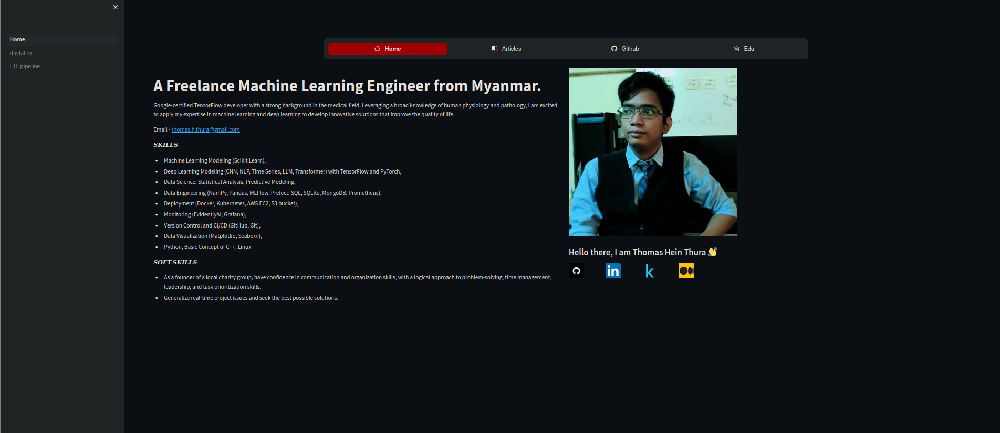
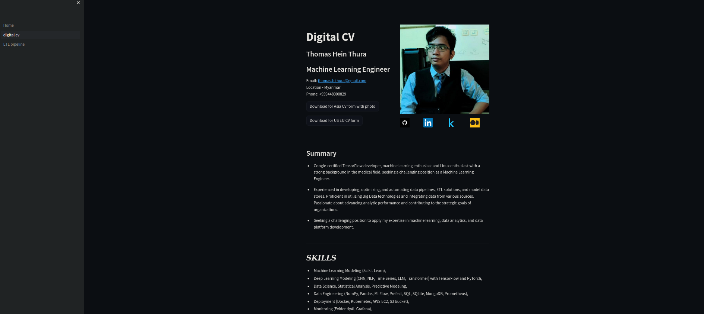

The project is for building a personal website.
* ETL pipeline is still undergoing. 

#### The original plan is to make the website with Fusion 5 projects
1. Personal Data and projects and article
2. Digital CV 
3. Text summarization website using hugging face, fine-tune model
4. Stable diffusion image generation
5. ETL pipeline

### Notes
* But the main problem is that there are no cloud servers with have each memory (RAM). Deployment become so hard. 
* So, Deploying both text summarization and stable diffusion becomes so hard. 
*  Text summarization needs 3 GB of RAM and stable diffusion needs 2 GB or more. 
*  And the website also takes more and more RAM when reloading the deep learning model pages. So even 16 GB of RAM can't handle it. 
*  You can move the text summarization Python file which is in the archive folder to the pages folder. 

### Deployment 
* The website is tested to deploy in zeet.co but I don't have any luck.
* The AWS EC2 is used to deploy. 
  * `Launch` the EC2 instance. And Make sure to open the `port:8501` in `network` config by clicking edit during making an instance. 
  * Then enter ssh or connect with EC2. 
  * install pip by downloading `curl -O https://bootstrap.pypa.io/get-pip.py` and install with `python3 get-pip.py --user`.
  *  Then install Python requirements libraries `pip install -r requirements.txt`
  *  Then run the website with `streamlit run Home.py`
  *  I found the error when you exit the terminal, the website is down. 
  *  To solve the problem you have to install `tmux` by `sudo yum install tmux`
  *  Then, open the tmux session by `tmux new-session -s streamlit` and close the terminal. 
  *  To enter the tmux session by `tmux a`

   
### The main problem 

* The text summarization takes a lot of memory and needs to adjust. 
  
### Further study
* if you have a deep learning server to deploy you can deploy The whole server on the server

